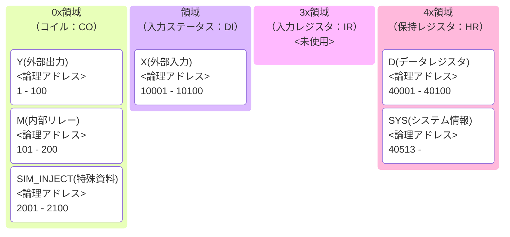

# Modbus Memory Map

PLC 内部メモリと Modbus アドレスの対応関係を定義します。

## メモリモデルと Modbus アドレスマップ

PLC内部メモリは、`modbus_server.py` 内の定義に基づき、
以下の通り Modbus アドレスにマッピングされます。

本シミュレータは、Modbus プロトコルの標準仕様に拡張を加えています。

**Coil領域は Y と M で共有されており、M は干渉防止のためオフセット 100（論理アドレス 101〜）から配置されます。**

**また、下記のSIM_INJECT 対応でオフセット 2000（論理アドレス 2001～)を利用するために、YとMは最大100個までの制限をする必要があります。**

### なお、本シミュレータでは、標準のModbus仕様（Discrete Inputは読み取り専用）を拡張した「SIM_INJECT」機能を搭載しています。
- **SIM_INJECT**: PLCの外部入力（X）に対し、Modbus経由での強制書き込みを可能にする機能です。これにより、Device Simulator からセンサー状態を注入できます。

## modbus標準仕様のアドレスマップ（概要）

## SimplePLCSimのアドレスマップ（概要）

| 種類 | 記号 | Modbus 種別 | 設定上限 | 論理アドレス | プロトコル・オフセット | 説明 |
| :--- | :--- | :--- | :--- | :--- | :--- | :--- |
| **外部入力** | **X** | **Discrete Input** (FC2) | 100 | `10001` 〜 | `0` 〜 | センサー等（Deviceが書込、PLCが読込） **※SIM_INJECT対象** |
| **SIM_INJECT** | X | **Coil** (FC1/FC5/FC15) | 100 | `2001` ～ `2100` | `2000` ～ `2099` 
**DeviceSimで指定するaddress**  `0` 〜`99`| **SIM_INJECT対象で利用**  設定は外部入力(X)の値から自動的に設定。|
| **外部出力** | **Y** | **Coil** (FC1/FC5/FC15) | 100 | `1` 〜 `100` | `0` 〜 `99` | アクチュエータ等（PLCが制御） |
| **内部リレー** | **M** | **Coil** (FC1/FC5/FC15) | 100 |**`101`** 〜 **`200`** | **`100`** 〜 **`199`** | 内部フラグ。Yとの干渉を防ぐ固定開始地点 |
| **データレジスタ** | **D** | **Holding Reg** (FC3/FC6/FC16) | 100 | `40001` 〜 | `0` 〜 | 数値データ（16bit整数） |
| **システム情報** | **SYS** | **Holding Reg** (FC3) | 指定不可(システム内固定） |**`40513`** 〜 | **`512`** 〜 | PLCの診断情報（標準的な産業I/Oの仕様に準拠） |

## システムレジスタ詳細 (オフセット `512`〜 / 論理アドレス `40513`〜)

SCADAやOrchestratorからPLCの内部状態を監視・制御するための特殊領域です。産業用リモートI/Oの「システム・ステータス」や「バーンアウトタイプ」の配置例を参考にしています。

| オフセット | 論理アドレス | プロトコル・オフセット| 項目名 | 内容 |
| :--- | :--- | :--- | :--- |
| `+0` | `40513` | `512` | **Heartbeat** | 0 と 1 が交互に変化（生存確認用） |
| `+1` | `40514` | `513` |**Scan Count** | 起動時からの累計スキャン回数 |
| `+2` | `40515` | `514` |**Uptime** | 起動からの経過時間（秒） |
| `+3` | `40516` | `515` |**Chaos Latency** | **Modbus応答遅延（秒）**。書き込むと即座に反映 |
| `+4` | `40517` | `516` |**Chaos Freeze** | **PLC一時停止**。書き込むと即座に反映 |
| `+5` | `40518` | `517` |**Chaos Packet Loss(将来予約)** | **PLCパケットロス**。％を数値で指定すると即座に反映 |

## 【重要】入力信号（X）への強制書き込み仕様 (SIM_INJECT)
通常、Modbusにおいて Discrete Input (X) は外部から書き込めませんが、本シミュレータでは以下のロジックでこれを可能にしています。

- **判定**: DeviceSimからの`write_coil` リクエストが `Discrete`の場合、サーバー内部で Discrete Input 用のデータブロックを直接書き換える割り込み処理を実行します。
- **用途**: `devicesim.py` や `iodevicesim.py` から、物理的なセンサー入力（X）として PLC に信号を注入するために使用します。

