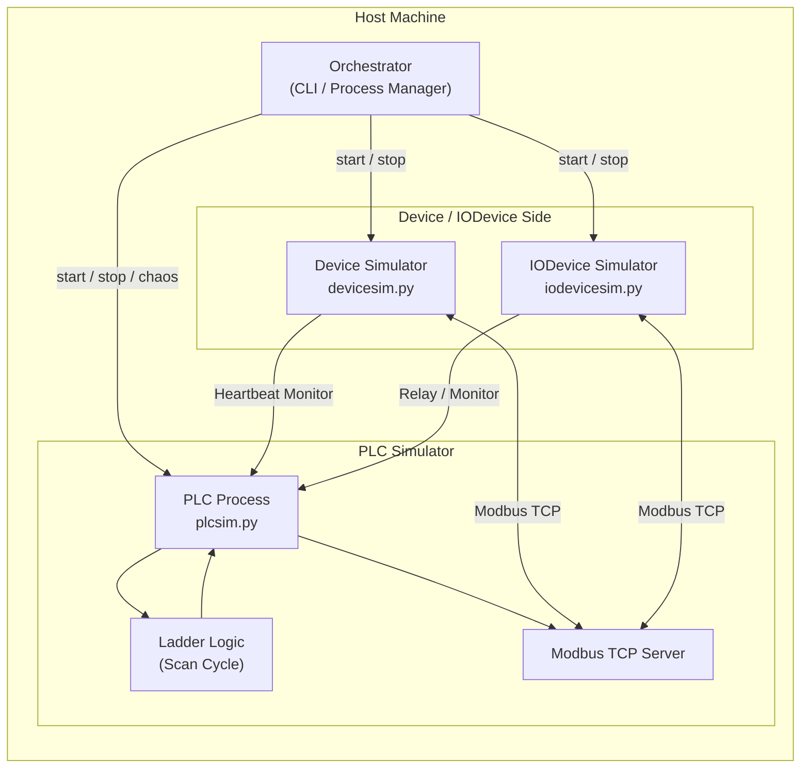

# PLC / SCADA 学習用シミュレータ
## アーキテクチャ技術資料（Architecture & Technical Reference）

本ドキュメントは **SimplePLCSim（PLC-SCADA Lab）** の
**内部アーキテクチャ、設計思想、通信仕様、設定ファイル仕様** を開発者向けに解説する技術資料です。

本資料は
**「なぜこの構成なのか」「内部で何が起きているか」** を明確にすることを目的とします。

---

## 1. 設計思想（Design Philosophy）

本システムは **PLC × 通信 × 監視が壊れたときの振る舞いを学習する** ため、以下の原則で設計されています。

### 1.1 学習対象の明確化

* PLC の **スキャンサイクル（Read → Execute → Write）**
* Modbus TCP を用いた **実通信**
* 通信断・遅延・CPU 停止といった **現実的な異常**
* 再接続・自己修復・連鎖停止といった **運用挙動**

「PLC を動かすこと」ではなく
**「PLC を取り巻く世界が壊れたときに何が起きるか」** を主眼とします。

---

## 2. システム全体構成

本システムは **役割分離されたマルチプロセス構成** を採用します。

### 2.1 コンポーネント一覧

| コンポーネント                | 役割                   |
| ---------------------- | -------------------- |
| **Orchestrator**       | プロセス管理・依存解決・Chaos 制御 |
| **PLC Simulator**      | 制御ロジック実行・Modbus サーバ  |
| **Device Simulator**   | センサー・物理挙動の模擬         |
| **IODevice Simulator** | PLC 間／外部との中継・演算      |

### 2.2 レイヤ構造



- Orchestrator は **制御専用**（業務ロジックを持たない）
- PLC Simulator は **スキャン実行と Modbus 提供に専念**
- Device / IODevice は **外部視点（SCADA / センサー役）**
- 通信異常と PLC 実行状態は **意図的に分離**


## この構成で「検証できること」

本シミュレータは、PLC を**正しく動かすこと**よりも、
**PLC・通信・監視が壊れたときの振る舞い**を検証するために設計されています。

本構成により、以下のような検証が可能です。

### 1. PLC スキャンと通信の非同期性

* PLC のスキャン処理は継続しているが、通信だけが遅延・停止するケース
* 内部メモリは更新されているが、SCADA からは遅れて見える状態

→ **「通信が生きている＝PLCが正常」とは限らない**ことを確認できます。


### 2. Heartbeat 監視の限界と設計妥当性

* Heartbeat が遅延するケース
* Heartbeat が停止するが TCP 接続は維持されているケース

→ 単純な Alive 判定では検知できない **グレーゾーン障害**を再現できます。


### 3. 自動再接続・再起動ロジックの挙動

* 一時的な通信断からの復帰
* PLC プロセス再起動時の状態リセット・再同期
* SCADA / Device 側のリトライ設計の検証

→ **「落ちた後にどう戻るか」**を実験できます。


### 4. PLC / SCADA 状態遷移モデルの検証

* Normal / Delay / Freeze / Kill の状態遷移
* Ready / Not Ready 判定の切り分け
* アラーム発報・復旧タイミングの妥当性確認

→ 実機に近い **状態ベース設計**を安全に試せます。


### 5. 障害注入（Chaos Engineering）の設計検証

* CPU フリーズと通信断の差異
* 遅延注入時のシステム挙動
* 中途半端な障害が最も厄介であることの再現

→ **「想定外は起きる」前提での設計確認**が可能です。


## 意図的に「やっていないこと」

本プロジェクトでは、学習・検証の焦点を明確にするため、
以下の点を**意図的に実装していません**。

### 1. 実PLCメーカー固有仕様の完全再現

* 特定メーカー（三菱 / Siemens / Allen-Bradley 等）の命令体系
* 実機固有のファームウェア挙動

→ **ベンダーロックを避け、概念理解を優先**しています。


### 2. 高速・高精度なリアルタイム制御

* μs〜ms 単位の厳密なタイミング保証
* ハードリアルタイム OS 前提の挙動

→ 本シミュレータは **制御品質ではなく振る舞い理解が目的**です。


### 3. 完全な Modbus 標準準拠

* Discrete Input への書き込み禁止などの厳密仕様

→ SIM_INJECT など、**検証のための意図的な拡張**を含みます。


### 4. GUI ベースの操作・可視化

* SCADA 画面やトレンド表示
* 操作パネル UI

→ 外部 SCADA / 可視化ツールとの **接続前提**で設計しています。


### 5. 本番運用向けの堅牢性保証

* 冗長化・フェイルオーバー構成
* セキュリティ強化（認証・暗号化）

→ 本プロジェクトは **学習・検証用**であり、本番利用を想定していません。


## 設計上のスタンス（補足）

```
このシミュレータは、
「現実を完全に再現する」ことよりも
「現実で何が起きるかを理解できる」ことを優先しています。
```

## 3. PLC Simulator 内部構造

PLC は実機同様の Scan Model を持つ（詳細は [コンポーネント](doc/Components.md) 参照）


## 4. システムレジスタ（SYS）

PLC には SYS と呼ばれる診断・制御用レジスタ領域が存在します。
これは PLC の状態遷移や Chaos 制御を外部から操作するための設計です。
詳細は [Modbusメモリ](doc/ModbusMemoryMap.md) を参照してください。
