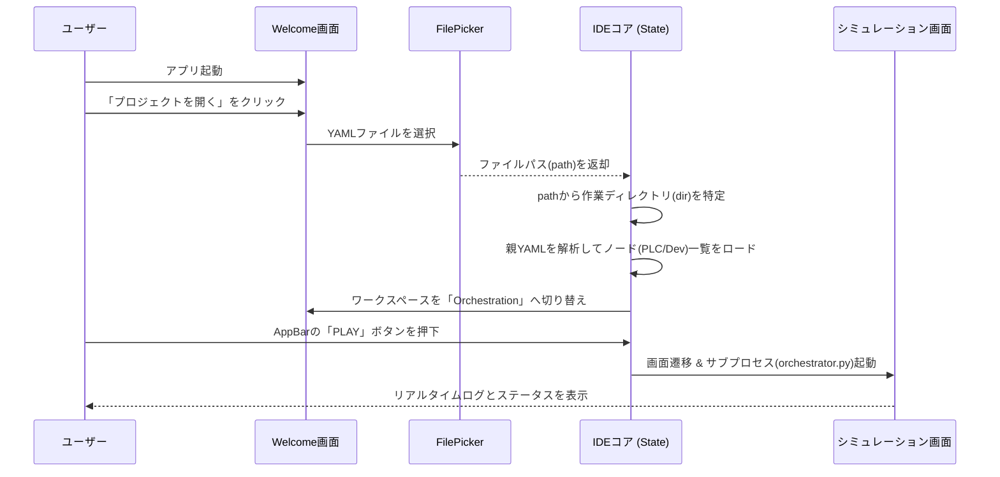
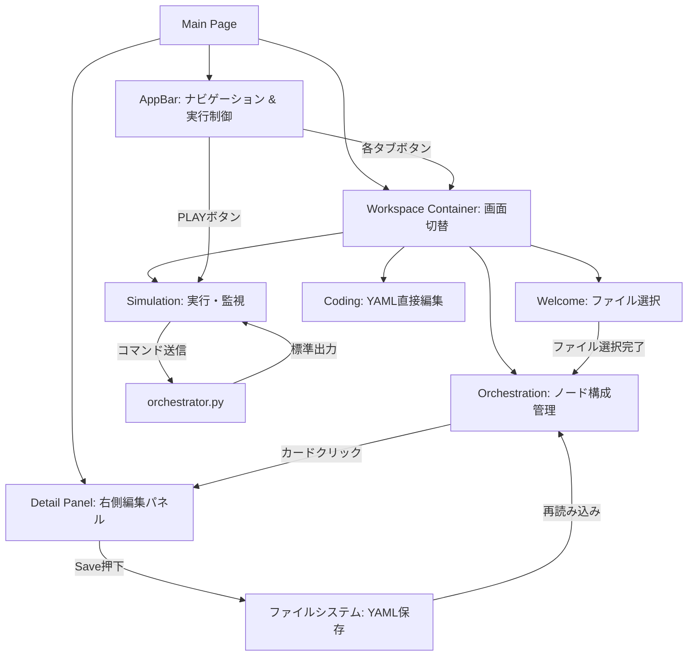

# base_design.md

## 1. プロジェクト概要

Flet (Python) を使用した、シンプルかつモダンな PLC シミュレーション環境の統合開発環境 (IDE)。
YAML ベースの設定ファイルを管理し、背後で動く `orchestrator.py` プロセスとリアルタイムで対話する。

## 2. 技術スタック

* **GUI Framework:** Flet (Version 0.26.0+ 推奨)
* **Execution Mode:** 完全非同期 (`async/await` ベース)
* **Data Format:** YAML (PyYAML)
* **Process Management:** `subprocess` + `threading` (非同期監視)
* **Package Manager:** `uv`

## 3. アプリケーション動線 (User Journey)

### Phase 1: Project Discovery (プロジェクト選択)

* **Entry:** アプリ起動時は「Welcome」ワークスペース。
* **Action:** `ft.FilePicker().get_directory_path()` を `await` で呼び出し、作業ディレクトリを確定。
* **State:** `project_dir` が確定すると、自動的に「Orchestration」ワークスペースへ遷移。

### Phase 2: Orchestration (構成設計)

* **View:** フォルダ内の `.yaml` ファイルをスキャンし、カード形式で一覧表示。
* **Logic:** - カードクリックで右側の「サイドパネル」が開き、設定を編集。
* 「Apply」で YAML ファイルを上書き保存。
* 新規作成ダイアログで `kind` (PLC/Device) と `name` を指定してファイル生成。

### Phase 3: Simulation (実行・監視)

* **Trigger:** AppBar の「PLAY」ボタン。
* **View:** 画面を分割し、「リアルタイムログ（左）」と「ノード状態一覧（右）」を表示。
* **Logic:**
* `orchestrator.py --config <path>` をサブプロセスとして起動。
* プロセスの `stdout` を `asyncio` で監視し、UI にストリーミング。
* 定期的な `status` コマンド送信により、デバイスの現在値を DataTable に反映。

### 起動からシミュレーションまでの動線

## 4. 画面構造 (Layout Design)

* **Top:** `AppBar` (プロジェクト名、ナビゲーション、実行ボタン)
* **Main:** `workspace_container` (動的にワークスペースを入れ替え)
* `WelcomeView`: 巨大なカード型ボタン
* `OrchestrationView`: グリッドレイアウトのコンポーネントカード
* `SimulationView`: コンソール、ライブモニターテーブル

* **Side:** `detail_panel` (編集用スライディングパネル)

### 画面構成と機能の遷移

## 5. 実装上の重要ルール (Flet 0.26+ 対応済)

### 非同期処理の原則

* すべての UI 更新は `await page.update()` を基本とする。
* ボタンイベント等の同期的なコンテキストから更新を呼ぶ場合は `asyncio.create_task(self.page.update())` を使用する。

### FilePicker の扱い

* インスタンス化して `overlay` に追加する古い手法は廃止。
* `await ft.FilePicker().pick_files()` のように、必要なタイミングで命令的に呼び出す。

### プロセス制御

* シミュレーション停止時は必ず `subprocess.terminate()` を呼び、ゾンビプロセスを防ぐ。
* `stdin.write()` の後は必ず `stdin.flush()` を行い、リアルタイムにコマンドを届ける。

## 6. 今後の拡張予定 (Roadmap)

* [ ] ドラッグ＆ドロップによるデバイス間の仮想接続設定
* [ ] 異常注入（Chaos Engineering）のプリセット登録機能
* [ ] PyInstaller による Windows 実行ファイル (.exe) へのパッケージ化

