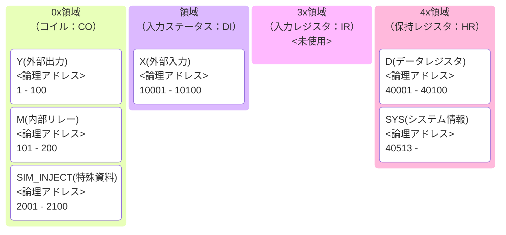

# PLC / SCADA 学習用 簡易シミュレータ (PLC-SCADA Lab)

## 概要

本リポジトリは、Webエンジニアの視点で**PLC（Programmable Logic Controller）のスキャンモデルとSCADAとの通信挙動を理解するため**に開発した学習用シミュレータです。

物理的なPLC実機やセンサーがなくても、Python上で「制御ロジック（PLC）」「物理デバイス（装置）」「プロセス監視（Orchestrator）」を動かし、Modbus TCPを介したデータの流れを体感・検証できます。

## システム構成図

1. **Orchestrator**: プロセス管理。PLC、Device、IODeviceを依存関係に基づき起動・監視。
2. **PLC Simulator**: ロジック演算（ラダー実行） + Modbus TCP サーバー。
3. **Device Simulator**: 仮想デバイス。PLCに接続し、センサー信号（X）を送り、出力（Y）を模倣。
4. **IODevice (Bridge)**: 異なるPLC間、あるいはPLCと外部システムを繋ぐ「神経」。条件に応じたデータ転送やハートビート監視を担当。

## 特徴

* **PLCスキャンサイクルの再現**: 読み込み・演算・出力の1サイクルをループ実行。
* **堅牢な再接続ロジック**: 通信途絶時もCPU負荷を抑えながら自動復帰を試みる「スマート・リコネクト」機能を搭載。
* **マルチプロセス管理**: `orchestrator.py` による一括管理。依存関係に基づいた起動順序制御。
* **カオスエンジニアリング**: 意図的なプロセス停止（`chaos kill`）による、SCADA側のエラーハンドリング検証。


## セットアップ

```bash
# リポジトリをクローン
git clone https://github.com/pekokana/SimplePLCSim
cd SimplePLCSim

# 仮想環境の作成と依存ライブラリのインストール
python -m venv venv
source venv/bin/activate  # Windows: venv\Scripts\activate
pip install -r requirements.txt

# pyproject.tomlも付属しているため、uvでの実行も可能です
# uvを利用する際には特に設定は必要ありません。

```

## 実行方法

最も簡単な方法は、オーケストレーターを使用して一括起動することです。

### 1. システム全体の一括起動（推奨）

```bash
python orchestrator.py orchestrator.yaml

# uvを利用する場合
uv run orchestrator.py orchestrator.yaml

# exeを利用する場合
orchestrator.exe orchestrator.yaml

```

これにより、PLC（`plcsim.py`）とデバイス（`devicesim.py`）が自動的に立ち上がり、相互に通信を開始します。

### 2. 個別起動（デバッグ用）

```bash
# PLCの起動
python plcsim.py plc_conf/plc_A/plc_A.yaml plc_conf/plc_A/ladder_A.yaml

# デバイスの起動
python devicesim.py device_conf/grinder.yaml

# exeを利用する場合
plcsim.exe plc_A.yaml ladder_A.yaml

```

---
# 各機能の詳細について

- [アーキテクチャ資料](doc\architecture.md) を参照してください。
---

## ラダーロジック構文ルール (Lark準拠)

本シミュレータのラダーロジックは、独自のLark構文定義（`ladder_parser.py`）に従って記述する必要があります。

### 基本構造

1行（1 Rung）は必ず **[条件式] --(出力命令)** の形式で記述します。

### 命令セットと記述例

| 命令カテゴリ | 命令名 | 構文定義上の構成 | YAMLでの記述例 |
| --- | --- | --- | --- |
| **コイル出力** | `(DEVICE)` | `DEVICE` | `X0 --(Y0)` |
| **タイマー** | `TON` / `TOF` | `INST DEVICE NUMBER` | `M0 --(TON T1 3000)` |
| **カウンタ** | `CTU` | `INST DEVICE NUMBER` | `X1 --(CTU C0 10)` |
| **リセット** | `RES` | `"RES" DEVICE` | `X2 --(RES C0)` |
| **代入・演算** | `=` | `calc_expr` | `M1 --(D10 = 100)` |

### 記述の鉄則（重要）

1. **接点始動**: 行の先頭は必ず接点（X, Y, M, T, C）または `[` で始めてください。
2. **出力の括弧**: 全ての出力命令（TON, RES, 演算等）は `--(` と `)` で囲む必要があります。
3. **出力の連結**: 1つの条件に対して、複数の出力を繋げることができます。
* 例: `X0 --(Y0) --(TON T1 500) --(D0 = 1)`


4. **タイマーの完了接点**: `TON T1` がタイムアップすると、接点 `T1` が自動的に True になります。


## メモリモデルと Modbus アドレスマップ

PLC内部メモリは、`modbus_server.py` 内の定義に基づき、以下の通り Modbus アドレスにマッピングされます。本シミュレータは、Modbus プロトコルの標準仕様に拡張を加えています。

**Coil領域は Y と M で共有されており、M は干渉防止のためオフセット 100（論理アドレス 101〜）から配置されます。**

**また、下記のSIM_INJECT 対応でオフセット 2000（論理アドレス 2001～)を利用するために、YとMは最大100個までの制限をする必要があります。**

#### なお、本シミュレータでは、標準のModbus仕様（Discrete Inputは読み取り専用）を拡張した「SIM_INJECT」機能を搭載しています。
- **SIM_INJECT**: PLCの外部入力（X）に対し、Modbus経由での強制書き込みを可能にする機能です。これにより、Device Simulator からセンサー状態を注入できます。

#### modbus標準仕様のアドレスマップ（概要）


#### SimplePLCSimのアドレスマップ（概要）



| 種類 | 記号 | Modbus 種別 | 設定上限 | 論理アドレス | プロトコル・オフセット | 説明 |
| :--- | :--- | :--- | :--- | :--- | :--- | :--- |
| **外部入力** | **X** | **Discrete Input** (FC2) | 100 | `10001` 〜 | `0` 〜 | センサー等（Deviceが書込、PLCが読込） **※SIM_INJECT対象** |
| **SIM_INJECT** | X | **Coil** (FC1/FC5/FC15) | 100 | `2001` ～ `2100` | `2000` ～ `2099`</br><hr>**DeviceSimで指定するaddress**</br> `0` 〜`99`| **SIM_INJECT対象で利用** </br>設定は外部入力(X)の値から自動的に設定。|
| **外部出力** | **Y** | **Coil** (FC1/FC5/FC15) | 100 | `1` 〜 `100` | `0` 〜 `99` | アクチュエータ等（PLCが制御） |
| **内部リレー** | **M** | **Coil** (FC1/FC5/FC15) | 100 |**`101`** 〜 **`200`** | **`100`** 〜 **`199`** | 内部フラグ。Yとの干渉を防ぐ固定開始地点 |
| **データレジスタ** | **D** | **Holding Reg** (FC3/FC6/FC16) | 100 | `40001` 〜 | `0` 〜 | 数値データ（16bit整数） |
| **システム情報** | **SYS** | **Holding Reg** (FC3) | 指定不可(システム内固定） |**`40513`** 〜 | **`512`** 〜 | PLCの診断情報（標準的な産業I/Oの仕様に準拠） |

#### システムレジスタ詳細 (オフセット `512`〜 / 論理アドレス `40513`〜)

SCADAやOrchestratorからPLCの内部状態を監視・制御するための特殊領域です。産業用リモートI/Oの「システム・ステータス」や「バーンアウトタイプ」の配置例を参考にしています。

| オフセット | 論理アドレス | 項目名 | 内容 |
| :--- | :--- | :--- | :--- |
| `+0` | `40513` | **Heartbeat** | 0 と 1 が交互に変化（生存確認用） |
| `+1` | `40514` | **Burnout Type** | 予約領域（0:なし, 1:Up, 2:Down） |
| `+2` | `40515` | **Scan Count** | 起動時からの累計スキャン回数 |
| `+3` | `40516` | **Uptime** | 起動からの経過時間（秒） |
| `+5` | `40518` | **Chaos Latency** | **Modbus応答遅延（秒）**。書き込むと即座に反映 |

#### 【重要】入力信号（X）への強制書き込み仕様 (SIM_INJECT)
通常、Modbusにおいて Discrete Input (X) は外部から書き込めませんが、本シミュレータでは以下のロジックでこれを可能にしています。

- **判定**: DeviceSimからの`write_coil` リクエストが `Discrete`の場合、サーバー内部で Discrete Input 用のデータブロックを直接書き換える割り込み処理を実行します。
- **用途**: `devicesim.py` や `iodevicesim.py` から、物理的なセンサー入力（X）として PLC に信号を注入するために使用します。


## インタラクティブ管理コンソール (CLI)

`orchestrator.py` を起動すると、各プロセスの標準出力は自動的にログファイルへリダイレクトされ、画面上には専用のプロンプトが表示されます。

### 主要コマンド

| コマンド | 内容 | 実行例 |
| --- | --- | --- |
| **`status`** (or `ls`) | 全プロセスの稼働状況、PID、Ready状態を一覧表示 | `status` |
| **`addr`** | 対象とするPLCのmodbusアドレスマッピング情報を表示 | `addr plc1` |
| **`info`** | 対象とするPLCの実行中のメモリ情報を表示 | `info plc1` |
| **`log`** | ログディレクトリからファイルを選択し、末尾数行を表示 | `log` |
| **`chaos`** | 意図的な障害（停止・遅延）を注入する | `chaos kill plc1` |
| **`help`** | 利用可能なコマンド一覧を表示 | `help` |
| **`exit`** | 全サービスを安全に停止して終了 | `exit` |


## カオスエンジニアリング（障害注入テスト）

SCADAのアラーム検知や再接続ロジックをテストするために、以下の障害を意図的に発生させることができます。

### 1. プロセスの強制終了・停止

* **`chaos kill <name>`**: プロセスを強制終了させます。PLCの場合、Orchestratorが検知して自動再起動を試みます（自動復旧テスト）。
* **`chaos stop <name>`**: プロセスを停止し、自動再起動を無効化します（メンテナンスや長期ダウンのテスト）。
* **`chaos resume <name>`**: 停止させたプロセスを再起動します。

### 2. 通信遅延（ネットワーク揺らぎ）の注入 

* **`chaos delay <name> <sec>`**:
指定した秒数だけModbusの応答を遅延させます。プロセスは生存しているが応答が極端に遅い「高負荷」や「通信不良」の状態を再現し、SCADA側のタイムアウト挙動を確認できます。

### 3. パケットロスの注入  <実装中>

* **`chaos ploss on/off <name> `**:
現在実装中ですが、たまに応答しないようなパケットロス挙動を設定可能になります。


## ライセンス

MIT License

