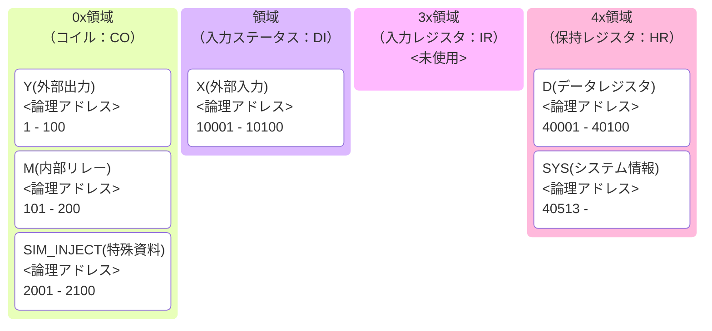

# PLC / SCADA 学習用 簡易シミュレータ (PLC-SCADA Lab)

## 概要

本リポジトリは、Webエンジニアの視点で**PLC（Programmable Logic Controller）のスキャンモデルとSCADAとの通信挙動を理解するため**に開発した学習用シミュレータです。


物理的な PLC 実機やセンサーがなくても、Python 上で以下を同時に再現できます。

- PLC のスキャンサイクル（Read → Execute → Write）
- Modbus TCP を介した I/O 通信
- Device / SCADA 側の監視・再接続ロジック
- 通信遅延・CPU フリーズなどの **現実的な異常状態**


本プロジェクトの目的は  
**「PLC を動かすこと」ではなく、「PLC・通信・監視が壊れたときの振る舞いを理解すること」**  
にあります。


## システム全体像

### コンポーネント構成

1. **Orchestrator (`orchestrator.py`)**
   - 全プロセスの起動・停止・依存関係管理
   - CLI による状態監視・Chaos 制御の起点

2. **PLC Simulator (`plcsim.py`)**
   - ラダーロジックのスキャン実行
   - Modbus TCP サーバー
   - システムレジスタ（Heartbeat / Freeze / Delay）

3. **Device Simulator (`devicesim.py`)**
   - 仮想デバイス（センサー・アクチュエータ）
   - PLC の X / Y / D を監視・操作
   - Heartbeat 監視による PLC 生存判定

4. **IODevice Simulator (`iodevicesim.py`)**
   - PLC 間、または PLC ↔ 外部システムのブリッジ
   - Heartbeat・通信状態の中継・監視


## 本シミュレータの特徴

- **PLC スキャンサイクルの再現**
  - 入力取得 → 演算 → 出力更新をループ実行

- **Modbus TCP を用いた実通信**
  - 疑似 API ではなく実プロトコルでの挙動検証が可能

- **マルチプロセス構成**
  - PLC / Device / IODevice を独立プロセスとして起動

- **スマート・リコネクト**
  - 通信断時も CPU 負荷を抑えた再接続制御

- **カオスエンジニアリング(Chaos Engineering) 対応**
  - プロセス停止・通信遅延・PLC フリーズを明示的に再現


## セットアップ

```bash
# リポジトリをクローン
git clone https://github.com/pekokana/SimplePLCSim
cd SimplePLCSim

# 仮想環境の作成と依存ライブラリのインストール
python -m venv venv
source venv/bin/activate  # Windows: venv\Scripts\activate
pip install -r requirements.txt

# pyproject.tomlも付属しているため、uvでの実行も可能です
# uvを利用する際には特に設定は必要ありません。

```

## 実行方法

最も簡単な方法は、オーケストレーターを使用して一括起動することです。

### 1. システム全体の一括起動（推奨）

```bash
python orchestrator.py orchestrator.yaml
# or
# uvを利用する場合
uv run orchestrator.py orchestrator.yaml
# or
# exeを利用する場合
orchestrator.exe orchestrator.yaml

```

これにより、PLC（`plcsim.py`）とデバイス（`devicesim.py`）が自動的に立ち上がり、相互に通信を開始します。

### 2. 個別起動（デバッグ用）

```bash
# PLCの起動
python plcsim.py plc_conf/plc_A/plc_A.yaml plc_conf/plc_A/ladder_A.yaml

# デバイスの起動
python devicesim.py device_conf/grinder.yaml

# exeを利用する場合
plcsim.exe plc_A.yaml ladder_A.yaml

```


# 各機能の詳細について

- [アーキテクチャ資料](doc/architecture.md) を参照してください。


## インタラクティブ管理コンソール (CLI)

`orchestrator.py` を起動すると、各プロセスの標準出力は自動的にログファイルへリダイレクトされ、画面上には専用のプロンプトが表示されます。

### 主要コマンド

| コマンド | 内容 | 実行例 |
| --- | --- | --- |
| **`status`** (or `ls`) | 全プロセスの稼働状況、PID、Ready状態を一覧表示 | `status` |
| **`addr`** | 対象とするPLCのmodbusアドレスマッピング情報を表示 | `addr plc1` |
| **`info`** | 対象とするPLCの実行中のメモリ情報を表示 | `info plc1` |
| **`log`** | ログディレクトリからファイルを選択し、末尾数行を表示 | `log` |
| **`chaos`** | 意図的な障害（停止・遅延）を注入する | `概要は以降の別章として説明を記載しています。` |
| **`help`** | 利用可能なコマンド一覧を表示 | `help` |
| **`exit`** | 全サービスを安全に停止して終了 | `exit` |

## Chaos Control（障害注入）の設計思想

本シミュレータの Chaos 機能は、  
単なる「プロセスを落とす機能」ではありません。

産業システムでは、以下のような **中途半端な異常状態** が最も厄介です。

- PLC CPU は停止しているが TCP 接続は生きている
- PLC は動いているが通信だけが極端に遅い
- 値は更新されているが SCADA からは遅れて見える

これらを再現するため、  
**PLC の実行状態** と **通信の状態** を分離した Chaos 制御を採用しています。

## Chaos Delay（通信遅延注入）

### 概要

```bash
chaos delay <plc_name> <sec>
````

PLC のスキャン処理は継続したまま、
**Modbus 応答および PLC → Modbus 同期処理に遅延を注入**します。

### 再現される状態

* PLC 内部ロジックは正常に進む
* メモリ値（D / Y / M）は更新され続ける
* Modbus 応答が遅延する
* Heartbeat は「遅れて」更新される

### 実機での対応例

* ネットワーク輻輳
* 通信モジュール高負荷
* スイッチ・ゲートウェイ劣化

> 遅延解除は `chaos delay <name> 0` で行います


## Chaos Freeze（PLC CPU フリーズ）

### 概要

```bash
chaos freeze <plc_name>
```

PLC のスキャン処理を完全に停止します。

### 再現される状態

* PLC スキャン停止
* Heartbeat / ScanCount 停止
* 内部メモリが固定
* Modbus TCP 接続自体は維持される

### 実機での対応例

* PLC CPU ハング
* 制御タスクのデッドロック
* ファームウェア異常

## PLC / 通信 / SCADA 状態遷移モデル

| 状態     | PLC Scan | Modbus Sync | 通信応答 | Heartbeat |
| ------ | -------- | ----------- | ---- | --------- |
| Normal | 実行中      | 実行中         | 即時   | 正常        |
| Delay  | 実行中      | 遅延          | 遅延   | 遅延        |
| Freeze | 停止       | 停止          | 応答あり | 停止        |
| Kill   | 停止       | 停止          | 接続不可 | 消失        |

この状態遷移を使い、以下を検証できます。

* SCADA のタイムアウト判定
* Heartbeat 監視の妥当性
* Ready / Not Ready の切り分け
* 自動復旧戦略の検証


## その他のChaos Control

SCADAのアラーム検知や再接続ロジックをテストするために、以下の障害を意図的に発生させることができます。

### 1. プロセスの強制終了・停止

* **`chaos kill <name>`**: プロセスを強制終了させます。PLCの場合、Orchestratorが検知して自動再起動を試みます（自動復旧テスト）。
* **`chaos stop <name>`**: プロセスを停止し、自動再起動を無効化します（メンテナンスや長期ダウンのテスト）。
* **`chaos resume <name>`**: 停止させたプロセスを再起動します。


### 3. パケットロスの注入  <実装中>

* **`chaos ploss on/off <name> `**:
現在実装中ですが、たまに応答しないようなパケットロス挙動を設定可能になります。


## メモリモデルと Modbus アドレスマップ

PLC内部メモリは、`modbus_server.py` 内の定義に基づき、以下の通り Modbus アドレスにマッピングされます。本シミュレータは、Modbus プロトコルの標準仕様に拡張を加えています。

**Coil領域は Y と M で共有されており、M は干渉防止のためオフセット 100（論理アドレス 101〜）から配置されます。**

**また、下記のSIM_INJECT 対応でオフセット 2000（論理アドレス 2001～)を利用するために、YとMは最大100個までの制限をする必要があります。**

#### なお、本シミュレータでは、標準のModbus仕様（Discrete Inputは読み取り専用）を拡張した「SIM_INJECT」機能を搭載しています。
- **SIM_INJECT**: PLCの外部入力（X）に対し、Modbus経由での強制書き込みを可能にする機能です。これにより、Device Simulator からセンサー状態を注入できます。

#### modbus標準仕様のアドレスマップ（概要）


#### SimplePLCSimのアドレスマップ（概要）



| 種類 | 記号 | Modbus 種別 | 設定上限 | 論理アドレス | プロトコル・オフセット | 説明 |
| :--- | :--- | :--- | :--- | :--- | :--- | :--- |
| **外部入力** | **X** | **Discrete Input** (FC2) | 100 | `10001` 〜 | `0` 〜 | センサー等（Deviceが書込、PLCが読込） **※SIM_INJECT対象** |
| **SIM_INJECT** | X | **Coil** (FC1/FC5/FC15) | 100 | `2001` ～ `2100` | `2000` ～ `2099`</br><hr>**DeviceSimで指定するaddress**</br> `0` 〜`99`| **SIM_INJECT対象で利用** </br>設定は外部入力(X)の値から自動的に設定。|
| **外部出力** | **Y** | **Coil** (FC1/FC5/FC15) | 100 | `1` 〜 `100` | `0` 〜 `99` | アクチュエータ等（PLCが制御） |
| **内部リレー** | **M** | **Coil** (FC1/FC5/FC15) | 100 |**`101`** 〜 **`200`** | **`100`** 〜 **`199`** | 内部フラグ。Yとの干渉を防ぐ固定開始地点 |
| **データレジスタ** | **D** | **Holding Reg** (FC3/FC6/FC16) | 100 | `40001` 〜 | `0` 〜 | 数値データ（16bit整数） |
| **システム情報** | **SYS** | **Holding Reg** (FC3) | 指定不可(システム内固定） |**`40513`** 〜 | **`512`** 〜 | PLCの診断情報（標準的な産業I/Oの仕様に準拠） |

#### システムレジスタ詳細 (オフセット `512`〜 / 論理アドレス `40513`〜)

SCADAやOrchestratorからPLCの内部状態を監視・制御するための特殊領域です。産業用リモートI/Oの「システム・ステータス」や「バーンアウトタイプ」の配置例を参考にしています。

| オフセット | 論理アドレス | 項目名 | 内容 |
| :--- | :--- | :--- | :--- |
| `+0` | `40513` | **Heartbeat** | 0 と 1 が交互に変化（生存確認用） |
| `+1` | `40514` | **Scan Count** | 起動時からの累計スキャン回数 |
| `+2` | `40515` | **Uptime** | 起動からの経過時間（秒） |
| `+3` | `40516` | **Chaos Latency** | **Modbus応答遅延（秒）**。書き込むと即座に反映 |
| `+4` | `40517` | **Chaos Freeze** | **PLC一時停止**。書き込むと即座に反映 |

#### 【重要】入力信号（X）への強制書き込み仕様 (SIM_INJECT)
通常、Modbusにおいて Discrete Input (X) は外部から書き込めませんが、本シミュレータでは以下のロジックでこれを可能にしています。

- **判定**: DeviceSimからの`write_coil` リクエストが `Discrete`の場合、サーバー内部で Discrete Input 用のデータブロックを直接書き換える割り込み処理を実行します。
- **用途**: `devicesim.py` や `iodevicesim.py` から、物理的なセンサー入力（X）として PLC に信号を注入するために使用します。


## ラダーロジック構文ルール (Lark準拠)

本シミュレータのラダーロジックは、独自のLark構文定義（`ladder_parser.py`）に従って記述する必要があります。

### 基本構造

1行（1 Rung）は必ず **[条件式] --(出力命令)** の形式で記述します。

```
# 例 sample_ladder.yaml
kind: ladder
version: "1.0"
rungs:
  # 1. 常時ON（TRUE）を利用して D0 を毎スキャンカウントアップ
  - "[ X0 ] --(D0 = D0 + 1)"
  # 2. D0が1000を超えたら 0 にリセット（これで数値が 0~1000 をループします）
  - "[ D0 > 100 ] --(D0 = 0)"
  # 3. D0が500以上のときだけ M10 をONにする（ON/OFFの確認用）
  - "[ D0 > 50 ] --(M10)"
  # 4. システムの生存確認用（10000番のHeartbeatとは別に、D1をスキャンごとに+1）
  - "D1 --(D1 = D1 + 1)"
  - "END"
```

### 命令セットと記述例

| 命令カテゴリ | 命令名 | 構文定義上の構成 | YAMLでの記述例 |
| --- | --- | --- | --- |
| **コイル出力** | `(DEVICE)` | `DEVICE` | `X0 --(Y0)` |
| **タイマー** | `TON` / `TOF` | `INST DEVICE NUMBER` | `M0 --(TON T1 3000)` |
| **カウンタ** | `CTU` | `INST DEVICE NUMBER` | `X1 --(CTU C0 10)` |
| **リセット** | `RES` | `"RES" DEVICE` | `X2 --(RES C0)` |
| **代入・演算** | `=` | `calc_expr` | `M1 --(D10 = 100)` |

### 記述の鉄則（重要）

1. **接点始動**: 行の先頭は必ず接点（X, Y, M, T, C）または `[` で始めてください。
2. **出力の括弧**: 全ての出力命令（TON, RES, 演算等）は `--(` と `)` で囲む必要があります。
3. **出力の連結**: 1つの条件に対して、複数の出力を繋げることができます。
* 例: `X0 --(Y0) --(TON T1 500) --(D0 = 1)`


4. **タイマーの完了接点**: `TON T1` がタイムアップすると、接点 `T1` が自動的に True になります。


## ライセンス

MIT License

